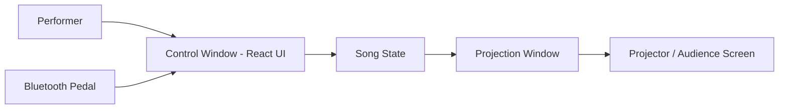

# Live Lyric Translator

Live Lyric Translator is a small performance tool I created to project translated lyrics during live concerts.

The songs are part of **Chango Pepper**, an artistic project where I write and perform music primarily in Spanish, often in front of international audiences. During performances, I wanted listeners to be able to follow the meaning of the lyrics without interrupting the natural rhythm of the music.

Most subtitle systems rely on precise time synchronization, which is fragile in a live performance. Tempos change, pauses appear, and songs evolve slightly from one concert to another.

Instead, this tool takes a simpler approach: I manually advance each translated line during the performance using a pedal or keyboard. This keeps the translation aligned with the music without requiring exact timing.

The result is a minimal and reliable subtitle system designed specifically for live concerts.

## ✨ Why this project exists

When performing songs in Spanish for international audiences, listeners often cannot follow the meaning of the lyrics.

Most subtitle systems require precise timing synchronization, which is fragile in live music situations.

This project takes a different approach:

➡ The performer manually advances the translation using a pedal or keyboard.

This makes the system simple, reliable, and performance-friendly.

## ⚙️ How it works

The application runs on a Mac mini and opens two windows.

### Control window

Used by the performer to:

• select songs  
• advance or go back one phrase  
• restart a song  
• blank the projection if needed  

### Projection window

Displayed on a projector and visible to the audience.

It shows only the translated lyric line.

Each phrase:

1. fades in  
2. remains visible briefly  
3. fades out automatically unless the performer advances  

## 🎭 Live performance setups

The system can be used with different hardware configurations depending on the context of the performance.

### Laptop setup (simplest)

The application can run directly on a Mac laptop, which is the simplest configuration.

**Hardware**

• Mac laptop running the application
• Projector connected via HDMI or USB-C
• Optional Bluetooth pedal for phrase navigation

In this setup:

• the projector displays the translation to the audience
• the laptop screen acts as the control interface

The performer advances phrases using either:

• the keyboard
• a Bluetooth pedal mapped to the arrow keys

This configuration is lightweight and ideal for rehearsals or smaller venues.

### Mac mini concert setup (current configuration)

For performances where a dedicated stage setup is preferred, the system can run on a Mac mini with a separate control display.

**Hardware**

• Mac mini — runs the application
• Projector — displays translated lyrics
• iPad — used as a touchscreen control screen via Sidecar
• Bluetooth pedal — used for Next / Previous

**Connections**

Mac mini → HDMI → Projector
Mac mini → USB-C → iPad (Sidecar)

**Operating systems tested**

• macOS 26.1
• iPadOS 26.3

Sidecar works over the cable and does not require internet access.

The pedal is paired with the Mac mini and mapped to keyboard arrow keys.

## 🎬 Concert workflow

Typical usage during a performance:

1. Start the application  
2. Open the projection window  
3. Select a song  
4. The system shows “Ready”  
5. Press Next to reveal the first translation  
6. Advance phrases during the performance  

## 🎛 Controls

### Control screen buttons

• Previous  
• Next  
• Restart  
• Open / Close Projection  
• Songs  

### Keyboard shortcuts

ArrowRight → Next phrase  
ArrowLeft → Previous phrase  
Space → Next phrase  
R → Restart song  
B → Toggle blank projection  
S → Open song selection  

## 🧪 Single-screen rehearsal mode

Normally the projection window ignores keyboard arrows for safety.

For rehearsal with a single screen run:

npm run dev:single

In this mode the projection window also responds to arrow keys.

## 🎼 Song format

Songs are stored as simple JSON files.

Each line contains:

• **es** — original lyric (Spanish)  
• **tr** — translated line displayed to the audience  

Example concept:

Spanish line → translated line

Song files are stored in the folder:

public

## 🧱 Technology stack

This project is built with:

• TypeScript — application logic  
• React — user interface  
• Vite — development and build system  
• Electron — desktop application framework  

Electron is used to open two synchronized windows:

• Control interface  
• Projection display  

## 🏗 Architecture

The application runs as a small desktop system composed of two synchronized windows.

• A control window used by the performer  
• A projection window displayed to the audience  

Both windows share the same song state so they stay synchronized during the performance.

This architecture keeps the system simple and reliable for live performances.

## 📁 Project structure

Main folders:

electron  
Contains the Electron main process and preload bridge.

src  
Contains the React application.

public  
Contains song JSON files.

Important files:

electron/main.cjs  
Electron main process.

electron/preload.cjs  
Secure bridge between Electron and the renderer.

src/App.tsx  
Main React application.

src/songState.ts  
Song state management.

src/useSongNavigation.ts  
Navigation logic.

src/useWebSocket.ts  
Window synchronization.

## 🛠 Development

**Install dependencies**

npm install

**Run the application**

npm run dev

Optional rehearsal mode

npm run dev:single

## 🤖 Credits

This project was developed iteratively using:

• Cursor (AI-assisted development environment)  
• ChatGPT for architecture design, debugging, and feature planning  

The goal of this project is both practical and experimental: exploring how AI-assisted development can accelerate the creation of small creative tools.

## 🎼 Artistic context

Chango Pepper is an artistic project centered on storytelling through music, images, and atmosphere.

The songs are written primarily in Spanish and draw from Latin American roots, personal memories, and the quiet poetry of everyday life. Performances aim to create an immersive space where melodies, words, and visual elements unfold together and invite the audience into a narrative journey.

Because these performances often take place in front of international audiences, the Live Lyric Translator was created as a simple way to make the lyrics accessible without interrupting the natural flow of the music.

More about the project and the music:
https://sites.google.com/view/changopepper/home
