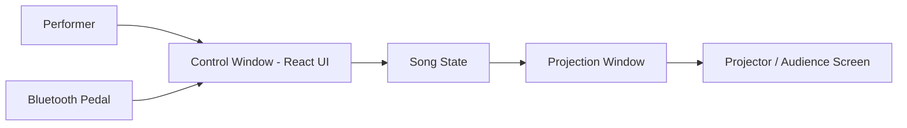

# Live Lyric Translator

<p align="center">

</p>

Live Lyric Translator is a small desktop tool designed to project translated song lyrics during live concerts.

The songs are part of **Chango Pepper**, an artistic project where I write and perform music primarily in Spanish, often in front of international audiences. During performances, I wanted listeners to be able to follow the meaning of the lyrics without interrupting the natural rhythm of the music.

Most subtitle systems rely on precise time synchronization, which is fragile in a live performance. Tempos change, pauses appear, and songs evolve slightly from one concert to another.

Instead, this tool takes a simpler approach: I manually advance each translated line during the performance using a pedal or keyboard. This keeps the translation aligned with the music without requiring exact timing.

The result is a minimal and reliable subtitle system designed specifically for live concerts.

## ✨ Why this project exists

When performing songs in Spanish for international audiences, listeners often cannot follow the meaning of the lyrics.

Most subtitle systems require precise timing synchronization, which is fragile in live music situations.

This project takes a different approach:

➡ The performer manually advances the translation using a pedal or keyboard.

This makes the system simple, reliable, and performance-friendly.

## ⭐ Key features

- Manual lyric progression designed for live performance
- Dual-window system (performer control + audience projection)
- Multilingual lyric support
- Independent singing and projection languages
- Next-phrase preview for the performer
- Played-song indicator in the Setlist
- Keyboard and pedal control
- Works fully offline during concerts

## ⚙️ How it works

The application runs as a small Electron desktop app and opens two synchronized windows.

### Control window

Used by the performer to:

- select a song from the Setlist
- choose the singing language
- choose the projection (translation) language
- advance to the next lyric phrase or go back to the previous one
- restart the current song
- temporarily blank the projection if needed 

### Projection window

Displayed on a projector and visible to the audience.

It shows only the translated lyric line.

Each phrase:

1. fades in  
2. remains visible briefly  
3. fades out automatically unless the performer advances  

## 📷 Screenshots

### Control screen — Setup

The performer selects the song, singing language, and projection language before starting the performance.


### Control screen — Performing

During the performance, the control screen shows the current phrase and the next phrase preview.


### Projection screen — Audience view

The audience only sees the translated lyric line currently being performed.


## 🎭 Live performance setups

The system can be used with different hardware configurations depending on the context of the performance.

### Laptop setup (simplest)

The application can run directly on a Mac laptop, which is the simplest configuration.

**Hardware**

- Mac laptop running the application
- Projector connected via HDMI or USB-C
- Optional Bluetooth pedal for phrase navigation

In this setup:

- the projector displays the translation to the audience
- the laptop screen acts as the control interface

The performer advances phrases using either:

- the keyboard
- a Bluetooth pedal mapped to the arrow keys

This configuration is lightweight and ideal for rehearsals or smaller venues.

### Mac mini concert setup (current configuration)

For performances where a dedicated stage setup is preferred, the system can run on a Mac mini with a separate control display.

**Hardware**

- Mac mini — runs the application
- Projector — displays translated lyrics
- iPad — used as a touchscreen control screen via Sidecar
- Bluetooth pedal — used for Next / Previous

**Connections**

Mac mini → HDMI → Projector  
Mac mini → USB-C → iPad (Sidecar)  

**Operating systems tested**

- macOS 26.1
- iPadOS 26.3

Sidecar works over the cable and does not require internet access.

The pedal is paired with the Mac mini and mapped to keyboard arrow keys.

## 🎬 Concert workflow

Typical usage during a performance:

1.	Start the application
2.	Open the projection window
3.	Select a song from the Setlist
4.	Choose the singing language
5.	Choose the projection (translation) language
6. The system runs readiness checks and shows **Ready** when:
   - a song is selected  
   - singing and projection languages are selected  
   - the projection window is open  
   - the lyric phrase list is loaded
7. Press **Arm** (button or **A** key), then press **Next** to reveal the first translation
8. Advance phrases during the performance

### Performance state machine

The control screen follows a simple state flow:

- **Setup** — Song and/or language selected; one or more checks are still failing. The UI shows which checks are missing (projection window open, translation available, phrase list loaded).
- **Ready** — All checks pass. The performer can press **Arm** to continue.
- **Armed** — Waiting for the first **Next** command. The next **Next** reveals the first line and moves to **Performing**. The performer can press **Unarm** (or **A**) to return to **Ready** without revealing.
- **Performing** — At least one phrase has been revealed. **Next** / **Previous** / **Restart** behave as usual. **Restart** returns to **Ready** (blank projection); press **Arm** again before the next run.

## 🎛 Controls

### Control screen buttons

- Previous
- Next — enabled only when Armed or Performing (from **Ready**, the performer must first press **Arm**)
- Restart
-	Open / Close Projection
- Arm / Unarm — available when the system is **Ready** or **Armed**
- Setlist
- Languages

### Keyboard shortcuts

ArrowRight / Space → Next phrase  
ArrowLeft → Previous phrase  
R → Restart song  
A → Arm (when Ready) / Unarm (when Armed)  
B → Toggle blank projection  
S → Open song selection  
L → Open language selection  

## 🌍 Language selection

The performer first chooses the singing language, then selects the projection language used to display the translated lyrics for the audience.

When selecting a language:
- the choice is stored locally
- the projection immediately switches to that language
- the setting persists between sessions

The currently selected language is displayed next to the Current song label on the control screen.

If a translation is missing for the selected language, that lyric line simply remains blank on the projection screen.

## 🧪 Single-screen rehearsal mode

Normally the projection window ignores keyboard arrows for safety.

For rehearsal with a single screen run:

npm run dev:single

In this mode the projection window also responds to arrow keys.

## 🎼 Song format

Songs are stored as simple JSON files.

Each entry represents one lyric line and contains the available language versions of that line.

Example structure:

```json
[
  {
    "title": "Pimiento",
    "lines": {
      "es": "Viejo pimiento,",
      "en": "Old pepper tree,",
      "fr": "Vieux pimentier,",
      "nl": "Oude peperboom,"
    }
  }
]
```

Fields:
- **title** — song title  
- **lines** — lyric text indexed by language code

Example language codes currently used:
- es — Spanish
- en — English
- fr — French
- nl — Dutch

This format makes it easy to add additional languages in the future without changing the application code.

Song files are stored in the `public` folder.

## 🧱 Technology stack

This project is built with:

- TypeScript — application logic  
- React — user interface  
- Vite — development and build system  
- Electron — desktop application framework  

Electron is used to open two synchronized windows:

- Control interface  
- Projection display  

## 🏗 Architecture

The application runs as a small desktop system composed of two synchronized windows.

- A control window used by the performer  
- A projection window displayed to the audience  

Both windows share the same song state so they stay synchronized during the performance.


```mermaid
flowchart LR

Performer --> Control[Control Window - React UI]

Control --> State[Song State]

State --> Projection[Projection Window]

Projection --> Audience[Projector / Audience Screen]

Pedal[Bluetooth Pedal] --> Control
```

This architecture keeps the system simple and reliable for live performances.

## 📁 Project structure

Main folders:

electron  
Contains the Electron main process and preload bridge.

src  
Contains the React application.

public  
Contains song JSON files.

Important files:

electron/main.cjs  
Electron main process.

electron/preload.cjs  
Secure bridge between Electron and the renderer.

src/App.tsx  
Main React application.

src/songState.ts  
Song state management.

src/useSongNavigation.ts  
Navigation logic.

src/useWebSocket.ts  
Window synchronization.

## 🛠 Development

### Install dependencies

npm install

### Run the application

npm run dev

Optional rehearsal mode (it requires only one monitor display, it allows previous and next commands to be executed from the projection screen)

npm run dev:single

## 🤝 Contributing

This project follows a strict **Red → Green → Refactor** workflow for development.

All new features and bug fixes should:
1. Define expected behavior.
2. Add failing tests first.
3. Implement the minimal change required.
4. Refactor only after tests are green.

See **CONTRIBUTING.md** for the full development guidelines.

## 🤖 Credits

This project was developed iteratively using:

- Cursor (AI-assisted development environment)  
- ChatGPT for architecture design, debugging, and feature planning  

The goal of this project is both practical and experimental: exploring how AI-assisted development can accelerate the creation of small creative tools.

## 🎼 Artistic context

Chango Pepper is an artistic project centered on storytelling through music, images, and atmosphere.

The songs are written primarily in Spanish and draw from Latin American roots, personal memories, and the quiet poetry of everyday life. Performances aim to create an immersive space where melodies, words, and visual elements unfold together and invite the audience into a narrative journey.

Because these performances often take place in front of international audiences, the Live Lyric Translator was created as a simple way to make the lyrics accessible without interrupting the natural flow of the music.

More about the project and the music:
https://sites.google.com/view/changopepper/home
