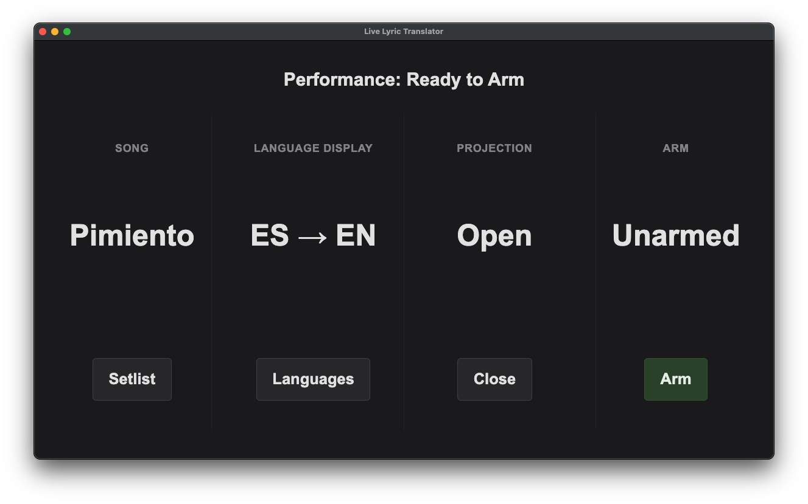
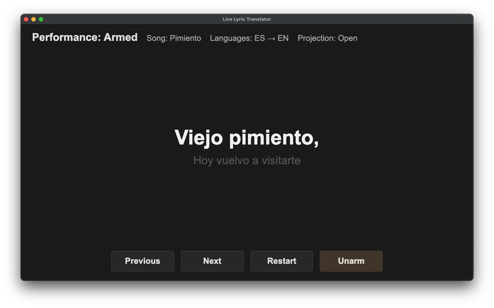
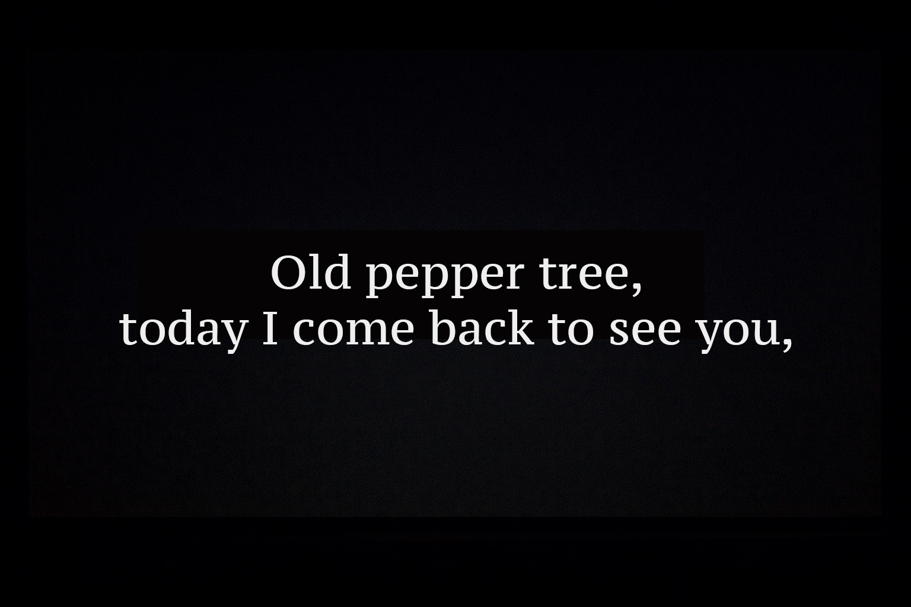
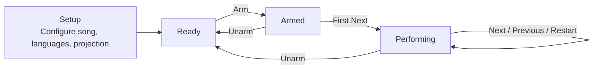
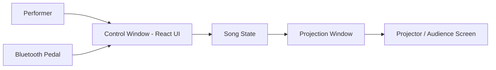

# Live Lyric Translator

<p align="center">

</p>

A minimal live subtitle system for concerts.

This application allows a musician to project translated lyrics in real time during a live performance.  
The performer advances each phrase manually while singing, allowing subtitles to stay aligned with the music without requiring precise timing.

## ✨ Features

- Manual lyric progression (live-performance friendly)
- Dual-window setup (control + projection)
- Multilingual lyrics
- Setlists and songs library management
- Next-line preview for performer
- Keyboard & pedal control
- Timer for concert
- Works fully offline

## 📷 Screenshots

### Control — Setup
<p align="center">

</p>

### Control — Performing
<p align="center">

</p>

### Projection — Audience view
<p align="center">

</p>

## 🚀 Quick Start

- npm install
- npm run dev

## ⚙️ How it works

Live Lyric Translator is a desktop application with two synchronized windows:

- a **Control window** (performer)
- a **Projection window** (audience)

The performer uses the Control window to prepare and run each song,  
while the Projection window displays the translated lyrics in real time.

### Control window

Used by the performer to:

- select songs and languages  
- control the flow of the performance  
- navigate through lyric lines  

### Projection window

Displayed on a projector and visible to the audience.

It shows only the current translated lyric line, without controls or additional information.

## 🎬 Performance workflow

During a performance, each song follows the same simple state flow.  
After a song ends, the performer returns to setup, selects the next song from the setlist, and arms the system again.

### Setup
The performer configures the upcoming song.

- select a song from the setlist  
- choose the singing language  
- choose the projection (translation) language  
- open / close the projection window  

The system is not ready yet until all required elements are in place  
(e.g. projection open, translation available, phrases loaded).

The control screen groups these actions into: Song, Languages, Projection, and Arm. The UI highlights what is missing to reach **Ready**.

### Ready
All checks pass. The system is ready for performance.  
Press **Arm** to begin.

### Armed
The system is primed and waiting.  
Arming the first song starts the concert timer.  
The next **Next** reveals the first line and starts the performance.

### Performing
The performance is in progress (at least one phrase shown).  
The concert timer is running.

- **Next / Previous** navigate between phrases  
- **Restart** restarts the current song while staying in **Performing**  
- **Unarm** exits the current run and returns to **Ready**

At the end of a song, the performer typically **unarms**, selects the next song, and repeats the cycle.

### State flow


```mermaid
flowchart LR

Setup["Setup\nConfigure song, languages, projection"] --> Ready["Ready"]
Ready -->|Arm| Armed["Armed"]
Armed -->|First Next| Performing["Performing"]

Performing -->|Next / Previous / Restart| Performing
Performing -->|Unarm| Ready
Armed -->|Unarm| Ready
```

## ⏱️ Concert timer

- Starts when the **first song is armed**
- Runs continuously during the performance
- Can be **paused** or **reset** at any time

## 🎭 Live performance setup (current configuration)

### Hardware

• Mac mini — runs the application  
• Projector — displays translated lyrics  
• iPad — used as a touchscreen control screen via Sidecar  
• Bluetooth pedal — used for Next / Previous  

**Note:** A Mac laptop can replace both the Mac mini and the iPad.

### Connections

Mac mini → HDMI → Projector  
Mac mini → USB-C → iPad (Sidecar)

### Operating systems tested

• macOS 26.1  
• iPadOS 26.3  

Sidecar works over the cable and does not require internet access.

The pedal is paired with the Mac mini and mapped to keyboard arrow keys.

## 🎛 Controls

### Control screen buttons

• Previous  
• Next  
• Restart  
• Open / Close Projection  
• Songs  

### Keyboard shortcuts (so that the pedal can be used)

ArrowRight → Next phrase  
ArrowLeft → Previous phrase  

## 🌍 Language selection

The performer first chooses the singing language, then selects the projection language used to display the translated lyrics for the audience.

When selecting a language:
- the choice is stored locally
- the projection immediately switches to that language
- the setting persists between sessions

The currently selected language is displayed next to the Current song label on the control screen.

If a translation is missing for the selected language, that lyric line simply remains blank on the projection screen.

## 🧪 Single-screen rehearsal mode

Normally the projection window ignores keyboard arrows for safety.

For rehearsal with a single screen run:

- npm run dev:single

In this mode the projection window also responds to arrow keys.

## 🎼 Song format

Songs are imported as JSON files and then stored in the app’s persistence layer. 

They can then be managed and organized into a Setlist for live performance.

```json
{
  "title": "Pimiento",
  "notes": "Capo 3, Acordes de DO",
  "lyrics": [
    {
      "es": "Viejo pimiento,\nhoy vuelvo a visitarte",
      "en": "Old pepper tree,\ntoday I come back to see you,",
      "fr": "Vieux pimentier,\naujourd’hui je reviens te voir,",
      "nl": "Oude peperboom,\nvandaag kom ik je weer bezoeken,"
    },
    ...
  ]
}
```

**Fields**
- `title` — song name
- `notes` *(optional)* — performer notes such as capo, key, or reminders
- `lyrics` — ordered list of lyric lines

Each lyric line contains translations indexed by language code, for example:
- `es` — Spanish
- `en` — English
- ...

Missing translations are allowed. In that case, the line remains blank in projection.

## 🧱 Technology stack

This project is built with:

• TypeScript — application logic  
• React — user interface  
• Vite — development and build system  
• Electron — desktop application framework  

Electron is used to open two synchronized windows:

• Control interface  
• Projection display  

## 🏗 Architecture

The application runs as a small desktop system composed of two synchronized windows.

• A control window used by the performer  
• A projection window displayed to the audience  

Both windows share the same song state so they stay synchronized during the performance.


```mermaid
flowchart LR

Performer --> Control[Control Window - React UI]

Control --> State[Song State]

State --> Projection[Projection Window]

Projection --> Audience[Projector / Audience Screen]

Pedal[Bluetooth Pedal] --> Control
```

## 🎵 About the artist

This project is part of the preparation for the live performances of **Chango Pepper**.

Chango Pepper blends Latin American roots, storytelling, and contemporary arrangements. The songs are primarily written in Spanish and performed for international audiences, hence the need for the Live Lyric Translator.

More about the project and the music:

https://sites.google.com/view/changopepper/home
