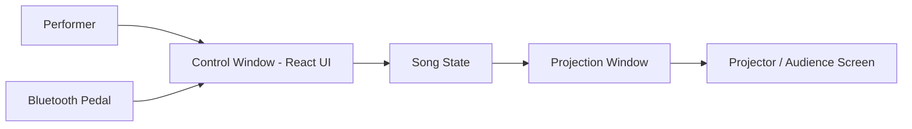

# Live Lyric Translator

<p align="center">

</p>

A minimal live subtitle system for concerts.

This application allows a musician to project translated lyrics in real time during a live performance.  
The performer advances each phrase manually while singing, allowing subtitles to stay aligned with the music without requiring precise timing.

---

## 📷 Screenshots

### Control — Setup


### Control — Performing


### Projection — Audience view


---

## ✨ Features

- Manual lyric progression (live-performance friendly)
- Dual-window setup (control + projection)
- Multilingual lyrics
- Setlists and songs library management
- Next-line preview for performer
- Keyboard & pedal control
- Timer for concert
- Works fully offline

---

## ⚙️ How it works

The app runs as an Electron desktop application with two synchronized windows:

- a **Control window** (performer)
- a **Projection window** (audience)

### Control window

The Control window adapts to two phases of the performance:

**Setup**
- select a song from the Setlist  
- choose the singing language  
- choose the projection (translation) language  
- open / close the Projection window  

**Performing**
- advance to the next lyric line or go back  
- restart the current song  
- temporarily blank the projection  

### Projection window

Displayed on a projector and visible to the audience.

It shows only the current translated lyric line, without controls or additional information.

---

## 🚀 Quick Start

npm install
npm run dev

---

### Performance state machine

The control screen follows a simple state flow:

- **Setup** — Song and/or language selected; one or more checks are still failing. The UI shows which checks are missing (projection window open, translation available, phrase list loaded).
- **Ready** — All checks pass. The performer can press **Arm** to continue.
- **Armed** — Waiting for the first **Next** command. The next **Next** reveals the first line and moves to **Performing**. The performer can press **Unarm** (or **A**) to return to **Ready** without revealing.
- **Performing** — At least one phrase has been revealed. **Next** / **Previous** / **Restart** behave as usual. **Restart** returns to **Ready** (blank projection); press **Arm** again before the next run.

---

## 🎭 Live performance setup (current configuration)

### Hardware

• Mac mini — runs the application  
• Projector — displays translated lyrics  
• iPad — used as a touchscreen control screen via Sidecar  
• Bluetooth pedal — used for Next / Previous  

**Note:** A Mac laptop can replace both the Mac mini and the iPad.

### Connections

Mac mini → HDMI → Projector  
Mac mini → USB-C → iPad (Sidecar)

### Operating systems tested

• macOS 26.1  
• iPadOS 26.3  

Sidecar works over the cable and does not require internet access.

The pedal is paired with the Mac mini and mapped to keyboard arrow keys.

---

## 🎛 Controls

### Control screen buttons

• Previous  
• Next  
• Restart  
• Open / Close Projection  
• Songs  

### Keyboard shortcuts (so that pedal can be used)

ArrowRight → Next phrase  
ArrowLeft → Previous phrase  

---

## 🌍 Language selection

The performer first chooses the singing language, then selects the projection language used to display the translated lyrics for the audience.

When selecting a language:
- the choice is stored locally
- the projection immediately switches to that language
- the setting persists between sessions

The currently selected language is displayed next to the Current song label on the control screen.

If a translation is missing for the selected language, that lyric line simply remains blank on the projection screen.

---

## 🧪 Single-screen rehearsal mode

Normally the projection window ignores keyboard arrows for safety.

For rehearsal with a single screen run:

npm run dev:single

In this mode the projection window also responds to arrow keys.

---

## 🎼 Song format

Songs are imported as JSON files and then stored in the app’s persistence layer. 

They can then be managed and organized into a Setlist for live performance.

```json
{
  "title": "Duelo",
  "notes": "Capo 3, Acordes de Mim",
  "lyrics": [
    {
      "es": "Como cualquier atardecer,",
      "en": "Like any fading sunset,",
      "fr": "Comme un soir qui s’efface,",
      "nl": "Zoals elke avond valt,"
    },
    ...
  ]
}
```

**Fields**
- `title` — song name
- `notes` *(optional)* — performer notes such as capo, key, or reminders
- `lyrics` — ordered list of lyric lines

Each lyric line contains translations indexed by language code, for example:
- `es` — Spanish
- `en` — English
- ...

Missing translations are allowed. In that case, the line remains blank in projection.

---

## 🧱 Technology stack

This project is built with:

• TypeScript — application logic  
• React — user interface  
• Vite — development and build system  
• Electron — desktop application framework  

Electron is used to open two synchronized windows:

• Control interface  
• Projection display  

---

## 🏗 Architecture

The application runs as a small desktop system composed of two synchronized windows.

• A control window used by the performer  
• A projection window displayed to the audience  

Both windows share the same song state so they stay synchronized during the performance.


```mermaid
flowchart LR

Performer --> Control[Control Window - React UI]

Control --> State[Song State]

State --> Projection[Projection Window]

Projection --> Audience[Projector / Audience Screen]

Pedal[Bluetooth Pedal] --> Control
```

---

## 🛠 Development

Install dependencies

npm install

Run the application

npm run dev

Optional rehearsal mode

npm run dev:single

---

## 🎵 About the artist

This project is part of the preparation for the live performances of **Chango Pepper**.

Chango Pepper blends Latin American roots, storytelling, and contemporary arrangements. The songs are primarily written in Spanish and performed for international audiences, hence the need for the Live Lyric Translator.

More about the project and the music:

https://sites.google.com/view/changopepper/home
