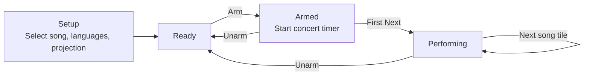
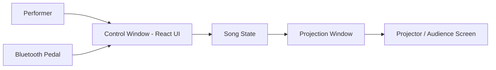

# Pregonero

<p align="center">

</p>

**A Spanish song performed for an audience that doesn't speak Spanish is a song they can hear but not be inside. Pregonero puts them inside it — the right line, in their language, on the screen behind you, at the moment you sing it.**

The name is the town crier: the one who makes the words reach everyone.

## Why it isn't just subtitles

A subtitle file assumes the performance will match the timing. Live, it won't — you hold a note, the audience laughs, you talk between verses, a string breaks.

So in Pregonero the **performer drives the screen**. Every line advances on a keyboard press or a foot pedal. Songs that have a synchronized animation can ride the video's own clock instead — and even then, a single pedal press re-seizes manual control mid-song, mid-video, no exceptions.

That override is the whole design, not a feature bullet. A live show does not get a second take, so every automatic path has a manual one underneath it that always wins.

## Who it's for

- musicians performing in one language to audiences in another
- touring acts facing a different mix of languages each night
- storytelling, theatre and spoken-word sets that want surtitles they can drive
- anyone who needs a caption screen that follows a **person**, not a timecode

## Runs offline

No network, no accounts, no API keys. Songs are local JSON, the two windows talk to each other over `localhost`, and the projection keeps working in a venue with no wifi — which is most of them.

Pregonero **displays** translations; it doesn't produce them. The translations are yours, written into the song JSON with whatever tools you like. Line *timings* for Video mode can be authored by hand or generated offline by [Bombista](https://github.com/jorgevallejos/bombista), its sibling tool, which Pregonero imports directly.

**Note:** Currently available on **macOS only**.

## ✨ Features

- **Two playback modes** (per song): **Manual** (keyboard/pedal, always the fallback) and **Video** (subtitles locked to a synchronized animation video via `video.currentTime`)
- **Manual override is always live** — an arrow/pedal press re-seizes control in Video mode
- Dual-window setup (control + projection)
- Multilingual lyrics, with translatable song **titles** and spoken **intros**
- **Video projection mode** — the app plays a clean animation full-screen and overlays the chosen audience language itself, replacing per-language/per-screen video exports
- **One clean video per song** — link a single animation export per song; the app composites the translated subtitle band on the fly, so you no longer maintain separate per-language or per-screen files
- **Big / Small display format** — pick the format at arming time. Both are the same full-frame layout (the video fills the screen with the subtitle superimposed); **Small just uses a larger subtitle font** for closer or smaller screens
- **Performer count-in / beat indicator** (per-song tempo, with compound-meter grouping) to lock in before the song rolls
- **End-card screen** for end-of-concert acknowledgements
- Setlists and songs library management
- Next-line preview for performer
- Keyboard & foot pedal control
- Concert timer
- Works fully offline

## 📷 Screenshots

### Control — Setup View
<p align="center">

</p>

### Control — Performing View
<p align="center">

</p>

### Projection — Audience view
<p align="center">

</p>

## 🚀 Quick Start

- `npm install`
- `npm run dev`

## ⚙️ How it works

Pregonero is a desktop application with two synchronized windows:

- a **Control window** (performer)
- a **Projection window** (audience)

The performer uses the Control window to prepare and run the performance,  
while the Projection window displays the translated lyrics in real time.

Performances are organized using setlists, which define the sequence of songs.

### Control window

Used by the performer to:

- select a setlist and songs  
- choose languages  
- control the flow of the performance  
- navigate through lyric lines  

### Projection window

Displayed on a projector and visible to the audience.

It shows only the current translated lyric line, without controls or additional information.

## 🎼 Setlists

Songs are organized into setlists.

- Setlists can be created and managed from the Setlist management screen  
- Songs can be added, removed, and reordered within a setlist  
- A performance always starts by selecting a setlist  

Once a setlist is active:
- the **first song is automatically selected** in Setup  
- the performer can select another song manually if needed  
- songs can be played sequentially during performance

## 🎬 Performance workflow

During a performance, the app follows a continuous setlist-based flow.  
The performer arms the concert once, then progresses through songs without returning to setup between each one.

After a song ends, the next song can be started directly from the Performing view, or the performer can return to Setup to make adjustments (song selection, languages, projection).

The first song of a setlist is automatically prepared when the setlist is selected.

### Setup
The performer configures the upcoming song.

- the first song is preselected from the active setlist (can be changed manually)  
- choose the singing language  
- choose the projection (translation) language  
- open / close the projection window  

The system is not ready yet until all required elements are in place  
(e.g. projection open, translation available, phrases loaded).

The control screen groups these actions into: Song, Languages, Projection, and Arm. The UI highlights what is missing to reach **Ready**.

### Ready
All checks pass. The system is ready for performance.  
Press **Arm** to begin.

### Armed
Arming the first song starts the concert timer and begins the concert session.  
The next **Next** reveals the first line and starts the performance.

### Performing
The performance is in progress (at least one phrase shown).  
The concert timer is running continuously across songs.

- **Next / Previous** navigate between phrases  
- **Restart** restarts the current song while staying in **Performing**  
- **Unarm** exits the current run and returns to **Ready**

When the last phrase of a song is reached, it is displayed normally.

Pressing **Next** once more reveals a centered tile for the **next song in the setlist**.  
Tapping this tile immediately starts the next song without returning to Setup.

The performer can still return to Setup at any time to:
- select a specific song  
- change languages  
- adjust projection settings

### State flow


```mermaid
flowchart LR

Setup["Setup\nSelect song, languages, projection"] --> Ready["Ready"]
Ready -->|Arm| Armed["Armed\nStart concert timer"]
Armed -->|First Next| Performing["Performing"]

Performing -->|Next / Previous / Restart| Performing
Performing -->|Next song tile| Performing
Performing -->|Unarm| Ready
Armed -->|Unarm| Ready
```

## 🎚 Playback modes

Each song plays in one of two modes. Manual is always available and always wins on override.

- **Manual** — the performer advances each phrase with the keyboard or foot pedal. The original, fully live mode; the default when a song has no media.
- **Video** — for songs with a synchronized animation, the projection plays a clean full-frame video (muted; the audience hears the live performance) and the app overlays the translated subtitle, locked to the video's clock. Because subtitles ride `video.currentTime`, a pause or stutter never desyncs them. This replaces switching to QuickTime and maintaining one exported video per language and per screen. On Play, a per-song **count-in** runs first, then the video starts — both driven off one clock so they stay locked.

A song's `timeline` is authored offline in the song JSON (or, later, by offline forced alignment); Video mode reads it. (Earlier *Timed* mode and in-app *record-by-tapping* were removed in the June 2026 rework.) Songs with no media stay in Manual mode.

## ⏱️ Concert timer

- Starts when the **first song is armed**
- Runs continuously across all songs in the setlist
- Can be **paused** or **reset** at any time

## 🎭 Live performance setup (current configuration)

### Hardware

- Mac mini — runs the application  
- Projector — displays translated lyrics  
- iPad — used as a touchscreen control screen via Sidecar  
- Bluetooth pedal — used for Next / Previous  

**Note:** A Mac laptop can replace both the Mac mini and the iPad.

### Connections

Mac mini → HDMI → Projector  
Mac mini → USB-C → iPad (Sidecar)

### Operating systems tested

- macOS 26.1  
- iPadOS 26.3  

Sidecar works over the cable and does not require internet access.

The pedal is paired with the Mac mini and mapped to keyboard arrow keys.

## 🎛 Controls

### Control screen buttons

- Previous  
- Next  
- Restart  
- Open / Close Projection  
- Songs  

### Keyboard shortcuts (compatible with foot pedals)

ArrowRight → Next phrase  
ArrowLeft → Previous phrase  

## 🌍 Language selection

The performer first chooses the singing language, then selects the projection language used to display the translated lyrics for the audience.

When selecting a language:
- the choice is stored locally
- the projection immediately switches to that language
- the setting persists between sessions

The currently selected language is displayed next to the Current song label on the control screen.

If a translation is missing for the selected language, that lyric line simply remains blank on the projection screen.

## 🧪 Single-screen rehearsal mode

Normally the projection window ignores keyboard arrows for safety.

For rehearsal with a single screen run:

- `npm run dev:single`

In this mode the projection window also responds to arrow keys.

## 🎼 Song format

Songs are imported as JSON files and then stored in the app’s persistence layer. 

They can then be managed and organized into a Setlist for live performance.

```json
{
  "title": "Pimiento",
  "notes": "Capo 3, Acordes de DO",
  "title_translations": { "en": "Pepper Tree", "fr": "Le pimentier", "nl": "Peperboom" },
  "intro": { "es": "...", "en": "..." },
  "tempo": { "bpm": 96, "numerator": 4, "denominator": 4, "countInBars": 1 },
  "media": { "type": "video", "src": "pimiento.mp4", "offset": 0, "trimStart": 0 },
  "timeline": [ { "start": 0.0, "end": 3.2 }, { "start": 3.2, "end": 7.5 } ],
  "lyrics": [
    {
      "es": "Viejo pimiento,\nhoy vuelvo a visitarte",
      "en": "Old pepper tree,\ntoday I come back to see you,",
      "fr": "Vieux pimentier,\naujourd’hui je reviens te voir,",
      "nl": "Oude peperboom,\nvandaag kom ik je weer bezoeken,"
    },
    ...
  ]
}
```

**Fields**
- `title` — song name
- `title_translations` *(optional)* — translated titles for the intro/title screen, indexed by language code
- `intro` *(optional)* — translatable spoken intro shown on the intro screen
- `notes` *(optional)* — performer notes such as capo, key, or reminders
- `tempo` *(optional)* — `{ bpm, numerator, denominator, countInBars }`, drives the performer count-in. `bpm` is the felt pulse (in 6/8, the dotted-quarter rate); `numerator`/`denominator` give the meter, with compound meters (6/8, 9/8, 12/8) grouped into dotted-quarter beats.
- `media` *(optional)* — a single video/audio file `{ type: "video" | "audio", src, offset?, trimStart? }` for Video mode. One clean export per song; the Big/Small display format is a projection toggle (full-frame layout, differing only in subtitle font size), **not** a separate file. `src` is a logical filename; the actual file is linked once per machine (via the camera dialog in Manage Setlists) and remembered locally (see [docs/media-assets.md](docs/media-assets.md)). Feed the app web-playable MP4s (H.264, ≤1080p), not ProRes masters.
- `timeline` *(optional)* — per-item `{ start, end }` in seconds, parallel to the lyrics/markers, driving Video-mode advancement. Both display formats share the one timeline (use `offset` to nudge alignment if needed).
- `lyrics` — ordered list of lyric lines

Each lyric line contains translations indexed by language code (`es`, `en`, `fr`, `nl`, …). Missing translations are allowed — the line simply stays blank in projection. Songs without the optional blocks behave exactly as before (Manual mode).

## 🧱 Technology stack

This project is built with:

- TypeScript (strict) — application logic
- React 18 — user interface
- Vite 8 — development and build system
- Electron 41 — desktop application framework
- Vitest 4 + React Testing Library — tests (jsdom)

Electron is used to open two synchronized windows:

- Control interface  
- Projection display  

## 🏗 Architecture

The application runs as a small desktop system composed of two synchronized windows.

- A control window used by the performer  
- A projection window displayed to the audience  

Both windows share the same song state so they stay synchronized during the performance.


```mermaid
flowchart LR

Performer --> Control[Control Window - React UI]

Control --> State[Song State]

State --> Projection[Projection Window]

Projection --> Audience[Projector / Audience Screen]

Pedal[Bluetooth Pedal] --> Control
```

## 🎵 About the artist

This project is part of the preparation for the live performances of **Chango Pepper**.

Chango Pepper blends Latin American roots, storytelling, and contemporary arrangements. The songs are primarily written in Spanish and performed for international audiences, hence the need for Pregonero.

More about the project and the music:

https://sites.google.com/view/changopepper/home
