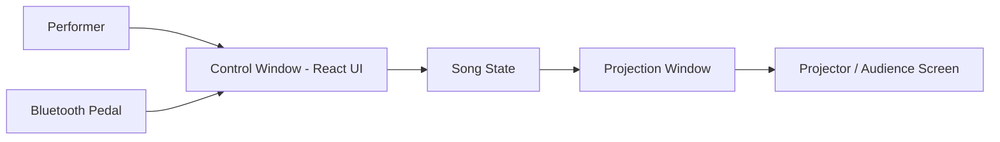

# Architecture

How Pregonero is built: the two-window design, the three playback modes, and the stack underneath. Split out of the README on 2026-08-14.

For how a show is actually run, see [performance-runbook.md](performance-runbook.md). For the deeper internals — state modules, the WebSocket and `localStorage` channels, the `media://` protocol, and the two gotchas that have cost real debugging time — see [`CLAUDE.md`](../CLAUDE.md) at the repo root, which is the working reference for contributors.

## How it works

Pregonero is a desktop application with two synchronized windows:

- a **Control window** (performer)
- a **Projection window** (audience)

The performer uses the Control window to prepare and run the performance, while the Projection window displays the translated lyrics in real time.

Performances are organized using setlists, which define the sequence of songs.

### Control window

Used by the performer to:

- select a setlist and songs
- choose languages
- control the flow of the performance
- navigate through lyric lines

### Projection window

Displayed on a projector and visible to the audience.

It shows only the current translated lyric line, without controls or additional information.

## Playback modes

Each song plays in one of three modes. Manual is always available and always wins on override.

- **Manual** — the performer advances each phrase with the keyboard or foot pedal. The original, fully live mode, and the default for a song with no timeline.
- **Auto** — for songs with a `timeline` and a `tempo` but no video. The beat clock drives the lyric index: the first pedal press is the start cue, and from there lines advance on their own against the song's own clock. The default when a song has a non-empty timeline.
- **Video** — for songs with a synchronized animation, the projection plays a clean full-frame video (muted; the audience hears the live performance) and the app overlays the translated subtitle, locked to the video's clock. Because subtitles ride `video.currentTime`, a pause or stutter never desyncs them. This replaces switching to QuickTime and maintaining one exported video per language and per screen. On Play, a per-song count-in runs first, then the video starts — both driven off one clock so they stay locked.

In Auto and Video, a manual **Next** or **Previous** does not just nudge the index — it drops the song into Manual for the remainder of the song. Before that behaviour existed, the auto-advance effect recomputed the index from elapsed time every tick and snapped back, so a manual press reverted within a tick: the buttons looked like a safety net and were not one.

A song's `timeline` is authored offline — by hand, or by [Bombista](https://github.com/jorgevallejos/bombista) — and lives **in the song's own JSON file**, which the app reads and never writes. It must declare `timelineVersion: 2` and carry a `leadIn` block; see [timeline-v2-contract.md](timeline-v2-contract.md). (Earlier *Timed* mode, in-app *record-by-tapping*, and the per-song timeline-import button were removed — the last of them when the library became references rather than copies.)

Two facts worth stating plainly, because both have been misread before:

- **The beat pulse is visual only.** There is no click track and never has been — `BeatCircle` renders it and there is no `AudioContext` anywhere in `src/`. The performer plays to the circle.
- **The pulse runs from Arm, not from the cue**, and the cue starts the song clock without re-phasing it. The performer owns the relationship between the beat and the first sung word.

## Technology stack

This project is built with:

- **TypeScript 5.6** (strict) — application logic
- **React 18** — user interface
- **Vite 8** — development and build system
- **Electron 41** — desktop application framework
- **Vitest 4 + React Testing Library** — tests (jsdom 28)
- **@dnd-kit** — drag-and-drop in setlist management
- **ws** — the WebSocket server
- **electron-builder** — packaging (`npm run pack`, macOS)

Electron is used to open the two synchronized windows, Control and Projection.

## System shape

The application runs as a small desktop system composed of two synchronized windows.

- A control window used by the performer
- A projection window displayed to the audience

Both windows share the same song state so they stay synchronized during the performance. The shared lyric state travels over a WebSocket server on `ws://localhost:8765`, run by Electron's main process; a second channel over `localStorage` storage events carries the commands where each window owns its own resource — video transport and seek, the end-card toggle — because each window renders its own `<video>` element and so cannot share a media clock.

