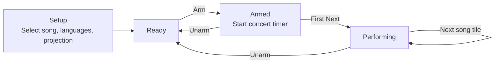

# Performance runbook

Everything about **running a show** with Pregonero: what the app gives you on stage, the workflow and its states, the controls, and the rig it runs on. Split out of the README on 2026-08-14; the README keeps what the project *is*, this keeps what you *do* with it.

For how it is built — the two windows, the playback modes, the stack — see [architecture.md](architecture.md).

## What you get on stage

- **Three playback modes** (per song): **Manual** (keyboard/pedal, always the fallback), **Auto** (timeline + beat clock, no video), and **Video** (subtitles locked to a synchronized animation via `video.currentTime`)
- **Manual override is always live** — an arrow/pedal press re-seizes control, and in Auto it drops the song into Manual for the rest of the song
- Dual-window setup (control + projection)
- Multilingual lyrics, with translatable song **titles** and spoken **intros**
- **Video projection mode** — the app plays a clean animation full-screen and overlays the chosen audience language itself, replacing per-language/per-screen video exports
- **One clean video per song** — link a single animation export per song; the app composites the translated subtitle band on the fly
- **Big / Small display format** — pick the format at arming time. Both are the same full-frame layout (the video fills the screen with the subtitle superimposed); **Small just uses a larger subtitle font** for closer or smaller screens
- **Performer count-in / beat indicator** (per-song tempo, with compound-meter grouping) to lock in before the song rolls
- **End-card screen** for end-of-concert acknowledgements
- Setlists and songs library management
- Next-line preview for performer
- Keyboard and foot pedal control
- Concert timer
- Works fully offline

## Screenshots

### Control — Setup View
<p align="center">

</p>

### Control — Performing View
<p align="center">

</p>

### Projection — Audience view
<p align="center">

</p>

## Setlists

Songs are organized into setlists.

- Setlists can be created and managed from the Setlist management screen
- Songs can be added, removed, and reordered within a setlist
- A performance always starts by selecting a setlist

Once a setlist is active:

- the **first song is automatically selected** in Setup
- the performer can select another song manually if needed
- songs can be played sequentially during performance

## Performance workflow

During a performance, the app follows a continuous setlist-based flow. The performer arms the concert once, then progresses through songs without returning to setup between each one.

After a song ends, the next song can be started directly from the Performing view, or the performer can return to Setup to make adjustments (song selection, languages, projection).

The first song of a setlist is automatically prepared when the setlist is selected.

### Setup

The performer configures the upcoming song.

- the first song is preselected from the active setlist (can be changed manually)
- choose the singing language
- choose the projection (translation) language
- open / close the projection window

The system is not ready until all required elements are in place: a song selected, both languages chosen, and the projection window open. The control screen groups these actions into Song, Languages, Projection, and Arm, and highlights what is missing to reach **Ready**.

### Ready

All checks pass. The system is ready for performance. Press **Arm** to begin.

### Armed

Arming the first song starts the concert timer and begins the concert session. **The beat pulse also starts here, not at the cue** — it free-runs from Arm so you can talk to the audience, pick the tempo up on guitar, and play an intro *to* the pulse before any words appear. The first **Next** reveals the first line and starts the song clock; it deliberately does not re-phase the pulse, so the beat you are playing to never jumps under your fingers.

### Performing

The performance is in progress (at least one phrase shown). The concert timer runs continuously across songs.

- **Next / Previous** navigate between phrases
- **Restart** restarts the current song while staying in **Performing**
- **Unarm** exits the current run and returns to **Ready**

In Auto or Video mode, pressing **Next** or **Previous** hands you the wheel: the song drops into Manual for the remainder of the song, rather than snapping back to the clock on the next tick. This is the escape hatch when drift shows up mid-song. It resets on the next song, the next arm, or a restart — it is never sticky.

When the last phrase of a song is reached, it is displayed normally. Pressing **Next** once more reveals a centered tile for the **next song in the setlist**; tapping it starts that song immediately, without returning to Setup.

The performer can still return to Setup at any time to select a specific song, change languages, or adjust projection settings.

### State flow



## Concert timer

- Starts when the **first song is armed**
- Runs continuously across all songs in the setlist
- Can be **paused** or **reset** at any time
- Reads in whole minutes, refreshed once a minute — it is a "how long have we been playing" glance, not a stopwatch

## Controls

### Control screen buttons

- Previous
- Next
- Restart
- Open / Close Projection
- Songs

### Keyboard shortcuts (compatible with foot pedals)

The pedal is mapped to keyboard arrow keys, so the two rows below are the same control surface.

| key | action |
|---|---|
| `→` *or* `Space` | Next phrase |
| `←` | Previous phrase |
| `R` *(hold)* | Restart the current song — held, not tapped, so a stray press cannot restart a song mid-line |
| `A` | Arm when Ready; Unarm when Armed |
| `S` | Songs screen |
| `L` | Languages screen |
| `B` | Blank / unblank the projection |

Shortcuts are ignored while typing in a text field.

## Language selection

The performer first chooses the singing language, then selects the projection language used to display the translated lyrics for the audience.

When selecting a language:

- the choice is stored locally
- the projection immediately switches to that language
- the setting persists between sessions

The currently selected language is displayed next to the Current song label on the control screen.

If a translation is missing for the selected language, that lyric line simply remains blank on the projection screen.

## Single-screen rehearsal mode

Normally the projection window ignores keyboard arrows, so that a stray keypress on the audience screen cannot advance the show.

For rehearsal on a single screen, start the app with the single-screen flag set:

```bash
npm run dev:single
```

That script is a thin wrapper over the actual mechanism — the `VITE_SINGLE_SCREEN` environment variable, read in `App.tsx` — so this is equivalent:

```bash
VITE_SINGLE_SCREEN=1 npm run dev
```

In this mode the projection window also responds to `←` / `→`.

## Live performance setup (current configuration)

This is the rig the app is actually run on, recorded so a venue surprise is a known quantity rather than a discovery.

### Hardware

- Mac mini — runs the application
- Projector — displays translated lyrics
- iPad — used as a touchscreen control screen via Sidecar
- Bluetooth pedal — used for Next / Previous

**Note:** A Mac laptop can replace both the Mac mini and the iPad.

### Connections

Mac mini → HDMI → Projector
Mac mini → USB-C → iPad (Sidecar)

### Operating systems tested

- macOS 26.1
- iPadOS 26.3

Sidecar works over the cable and does not require internet access.

The pedal is paired with the Mac mini and mapped to keyboard arrow keys.
